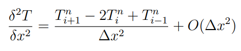

# Studying a heat conduction problem

## Contents

1.  [Abstract](#abstract)
2.  [Introduction](#introduction)
3.  [Methods and Procedures](#methods-and-procedures)
    1.  [Finite Difference Methods and Truncation Errors](#finite-difference-methods-and-truncation-errors)
    2.  [Explicit Methods](#explicit-methods)
    3.  [Implicit Methods](#implicit-methods)
4.  [Design and Implementations](#design-and-implementations)
5.  [Results](#results)
    1.  [The Richardson Method](#the-richardson-method)
    2.  [Stable Methods](#stable-methods)
    3.  [Laasonen Method](#laasonen-method)
    4.  [Studying the Error](#studying-the-error) 
6.  [Discussion](#discussion)
7.  [Conclusion](#conclusion)
8.  [Future work](#future-work)

## Abstract

To study the unsteady one-space dimensional heat conduction equation with finite
difference methods, four different numerical methods are presented. Two of them
being explicit methods and the other two being implicit methods. The studied explicit
schemes are the Richardson and the DuFort-Frankel schemes, while the implicit ones
are the Laasonen and Crank-Nicholson schemes. Each scheme’s numerical solutions
are compared to the analytical solution. It is observed that the Richardson method
is unconditionally unstable, therefore it is not usable. We studied the influence of
varying ∆t on the results and on the computational time of the Laasonen method,
which made it clear that increasing the ∆t of the discretized space will also increase
the truncation error and reduce the computational time. The solutions show that the
Crank-Nicholson method is the most accurate.

## Introduction

Numerical methods for Partial Differential Equations (PDE) are used to obtain approximate solutions to real-world problems where exact solutions do not always exist. One of the several techniques to find these numerical approximations is the Finite
Difference Method (FDM) which we will study in this report and use to
solve a parabolic partial differential equation in one-dimensional space. Specifically,
we will study the heat conduction PDE which describes how the temperature diffuses
in a given space over time.

A wall of 1 ft thickness and boundless in other directions has an initial temperature
Tin of 100◦F. The exterior surface temperatures of both sides of the wall are suddenly
increased to Tsur = 300◦F and maintained at that temperature. Additionally, the
wall is composed of nickel steel (40% Ni) with a diffusivity D of 0.1 ft²/h.

The unsteady one-dimensional space heat PDE to be solved is given by the following
equation:

Where T(x, t) is the dependent variable, and D is the heat diffusivity variable.
  
To solve the heat transfer equation, an initial condition was given: T(x, 0) = 100
for all x, 0 <= x <= L; and boundary conditions T(0, t) = 300, T(L, t) = 300 for all
times t, 0.0 <= t <= 0.5.
  
The analytical solution of the equation is given by the following expression:

## Methods and Procedures

### Finite Difference Methods and Truncation Errors

The finite difference methods are one of many approaches to find numerical approximations for the heat PDE. Applying the FDM to the heat PDE involves discretizing the continuous problem into a finite number of points in the space domain of interest,
where the unknown values of the discrete space, also called nodes, are computed over
time. The discretization methods are characterised by two main parameters: ∆x,
which represents the distance between two neighboring nodes in space and is set to
∆x=0.05 for this study, and ∆t which is the interval between two adjacent time steps.
The number of nodes is given in the heat problem definition and is equal to L ∆x+1=21
nodes, where L is the length of the wall and is equal to 1ft. The nodes are uniformly
spaced in the interval given 0 <= x <= L.
Regarding the time steps, also provided in the problem definition, the values of time
are between 0 <= t <= 0.5hrs; thus, the number of nodes representing the time steps
in the t axis is equal to 0.5
∆t+1=51 time steps. The following figure is an illustrative representation of the mesh structure of the numerical solution, where the x and t axis represent the space and time dimension domains of the heat PDE, respectively.

  
The truncation error is the difference between the analytical solution and the approximate solution (numerical solution) computed with the numerical method in a
specific node in the mesh [1, 5]. To quantify the TE of a numerical scheme, we create
a vector composed of the TE of each node at a specific time step. Then, we compute
the norm of the TE vector. The way to calculate that norm can differ, as there are
different norm formulas. The two norms that are useful in our case are the L1 and
the L2 norms. They are represented by the expressions (2.1) and (2.2), respectively.

  

  
The difference between those two norms is that the L2 norm will exacerbate the large
errors and will reduce the impact of the small errors, whereas in the L1 norm, every
error has the same weight.
We chose the L2 norm over the L1 norm, because it highlights large truncation errors
within an error matrix.
  
In this report, four numerical methods are studied to obtain numerical solutions to
the heat transfer PDE; two of which, DuFort-Frankel and Richardson, are explicit and
the two others, Laasonen Simple Implicit and Crank-Nicholson, are implicit methods.
For each scheme, it is assumed that ∆x = 0.05 and ∆t = 0.01. In all methods, the
numerical solutions are computed for all space points every 0.1hrs from 0.0 to 0.5hrs.
Additionally, specifically for the Laasonen Simple Implicit method, the solution is
also studied with the following time step sizes: ∆t = 0,01, ∆t = 0.025, ∆t = 0.05,
∆t = 0.1, with ∆x held constant at ∆x = 0.05. 
  
### Explicit Methods
  
Explicit methods are used in numerical analysis to obtain numerical approximations
of a PDE. In these methods, a value is calculated based on previous steps (in our
case time steps). Explicit methods are supposed to be simple to use as they are independent of other values on the same time step, which means that in the end, every
value is calculated using one single equation [1, 6, 7]. While some explicit schemes
require the values from one previous time step, called one-step schemes, others, such
as DuFort-Frankel and Richardson schemes, need two sets of initial values from two
previous time steps to compute a solution.

The first set of values is completed with the initial conditions, and the second set
of values is computed using a one-step scheme, in our case the FTCS scheme. This
scheme was chosen because it is conditionally stable, with its stability condition being:

  
With D= 0.1, ∆t=0.01, (∆x)2=0.05 we obtain:

  
Hence, we can conclude that the FTCS scheme is stable considering the parameters
of our problem. Below is the equation of the FTCS scheme and its stencil.
  

  
Using these results, We will study the heat transfer problem using the Richardson
and the DuFort-Frankel schemes.

#### Richardson Method
  
This scheme uses central differencing for both time and space dimensions [1]. As such
we obtain the following equation for the Richardson scheme:
  

  

  
Translated to our equation:
  

  
The order of accuracy of the Richardson’s scheme is of [∆t²; ∆x²] but the Richardson
scheme is unconditionally unstable [1], meaning that it will not produce any reliable results regardless of the given the parameters. Mathematical demonstration of the stability and the accuracy of the Richardson scheme can be found in the appendix.

#### DuFort-Frankel
  
This scheme also uses central differencing for both time and space parts:
  

  

  
Taylor’s expansion of both the space and time dimensions are the same as the Taylor’s expansion of the Richardson scheme with only a change in the space dimension
concerning the Tn
i
.
The order of accuracy of the DuFort-Frankel scheme is of [∆t², ∆x², (∆t/∆x)²].
Contrary to the Richardson scheme, DuFort-Frankel is unconditionally stable.

### Implicit Methods
  
Implicit schemes are other methods used to obtain numerical solutions. In these
methods, more than one unknown appears in the discretized equation (2.11).
When using the first-order backward derivative in time and the second-order derivative in space, the equation (1.1) would be re-written as:

  
One principal advantage of the implicit methods is that they are known to be unconditionally stable; thus, large time step sizes are allowed. However, they are bounded
by the accuracy requirement of the solution, as the TE of the numerical solutions will
increase by increasing the time steps size [1].
From the equation (2.11), we notice that there are three unknowns T
n+1
i+1 , T n+1
i
, T n+1
i−1
,
which requires solving a tri-diagonal system matrix of the form A * x = d at each
(n+1) time step. This system matrix can efficiently be solved by applying the Thomas
Algorithm. The algorithm depends on LU decomposition, where the matrix A can be
re-written as A = LU, in which L and U are the lower and upper triangular matrices,
respectively. Thomas algorithm consists of two steps. In the first step, Lp = d is
computed in forward elimination step, resulting the equation Ux = p, which solves
the solution for x in the second step also called backward substitution step [1][3].
In this section, we studied Laasonen and Crank-Nicholson implicit methods for solving
the unsteady heat conduction PDE in one-dimensional space.

#### Laasonen Simple Implicit Scheme
  
The Laasonen implicit method is a forward derivative in time and central derivative
in space, and is unconditionally stable of an accuracy order of O(∆t, ∆x
2
). The
simple expression of the equation (2.11) is known as Laasonen simple implicit scheme
[1]. Figure 2.5 is a schematic representation of the Laasonen implicit solution.

  

  
Now, considering m the number of space steps, the first and last values of the space
points, at each time step, are given in the problem definition and represented by the
left and right BC, both being equal to 300. Therefore, to compute the second space
step, we rearrange the unknowns to the left side and the known to the right side of
the equation (2.12), which then took the following form:

 
For the next to last space step, the equation (2.10) took the form of:
  

For all other unknowns, the computation would be expressed as:
  

  
The system matrix A * x = d is set as following:
  

  
#### Crank-Nicholson Scheme
  
Using Crank-Nicholson scheme, the equation (1) is discretized as the following:
  

  
  
The Crank-Nicholson implicit method is a first-order derivative in time and an average
of central differences in time steps n and n+1, and is unconditionally stable with an
accuracy order of O(∆t
2
, ∆x
2
) [1][4]. Figure 2.6 is a schematic representation of the
Crank-Nicholson implicit method.
  

  
  
For purpose of clarity we consider q = T
n
i−1 + T
n
i+1 and by applying the BC and initial
conditions, the second space step could be calculated after rearranging the equation
(2.17) as following:

  
Regarding the next to last value, the equation (2.17) would be:
  

  
  
For all other unknowns, the equation (2.17) would take the following form:  
  

  
  
Finally, we set the system matrix A ∗ x = d:
  

  
  
## Design and Implementations
  
Regarding the design of the heat PDE solutions, we chose Object-Oriented Design
(OOD) using UML and Object-Oriented Programming (OOP) using C++. We first
designed the solution at a high-level structure using a UML class diagram, then the
design underwent several improvements. We started by creating a class Parameters,
that encloses all the heat transfer PDE properties, as private data members, such as
diffusivity, ∆x, ∆t, the wall length L, time steps, space steps, initial and boundary
conditions; and defined accessor methods, which allows us to achieve encapsulation.
After that, we created two abstract classes ExplicitSchemes and ImplicitSchemes,
both use the class Parameters.
Richardson and DuFort-Frankel methods need to have at least the two previous time
steps’ results available in memory. Rather than using an array with all the time steps,
we use three vectors in order to save memory space. The data of specific time steps
are not lost since they are stocked inside an offset file generated every time a scheme
is computed using a solve() function.
The class ExplicitSchemes is inherited by the two explicit schemes DuFort-Frankel
and Richardson. Figure 3.1 illustrates the UML design of the explicit schemes.

  
  
We apply the same design logic for the implicit schemes by creating an abstract class
ImplicitSchemes that is inherited by Laasonen and CrankNicholson classes. Figure
3.2 is a schematic representation of the UML diagram of the implicit schemes.

  
  
In parallel, we created the AnalyticalSolution class that solves the heat PDE’s analytical solution.
We decided against implementing exception handling in our program, as our solution is not interacting with the end-user. The parameters of the equation are hard
coded as they are constants. Therefore, if data validation exception handling was
implemented, it would never be executed, which would lead to dead code.
Regarding the print and plot of the results, we created a Printer class that generates ”.csv” files for each numerical methods’ result. The Printer class also generates
files for the analytical solution and the computational time of each numerical scheme.
Thus, it was easy to make changes regarding the display of the results and any other
update in the methods’ implementation.
For each class explained above, a .h header file with appropriate data and functions members is created. Each header file contains its data members declarations
and the functions signatures. The implementation of these function members and the
initialisation of the data members was done in the .cpp file of its corresponding class.
Finally, all the objects of the methods were instantiated and created in the .cpp
main file. The print results of the different methods as well as their corresponding
computational time were created and exported to the OutPutFiles folder, which made
the code organization clean.
Figure 3.3 represents the complete UML class diagram of the heat transfer PDE solutions.
  

  
## Results
  
In this section we will present the results of the Richardson and the DuFort-Frankel
explicit methods and the Laasonen and Crank-Nicolson implicit methods that we
studied. If not specified we use ∆x = 0.05 and ∆t = 0.01.

### The Richardson Method
  
### Stable Methods
  
### Laasonen Method
  
### Studying the Error
  
## Discussion
  
## Conclusion
  
In this report, we have solved the heat conduction partial differential equation in
one-space dimension by applying four schemes of the finite difference methods. The
numerical and analytical solutions were coded in C++ and graphically represented as
well. It was clear that the solutions obtained with the numerical methods correspond
to the expected properties.
  
It was shown that the Richardson method is unconditionally unstable, therefore, it is
not usable. It could be observed that the FTCS scheme, used to compute the initial
values of the DuFort-Frankel method, permits the DuFort-Frankel scheme to give
adequate solutions. It was seen that the FTCS scheme was stable with the chosen
parameters.
  
Through the use of implicit schemes, it was proven that the practicality and accuracy of the numerical solutions are time-dependent, i.e., by taking small time steps, the solution is time-expensive, and by applying large time steps, it is leading to an
increase of the truncation errors. When a fitting time step that satisfies the accuracy
criterion was applied, those schemes proved to be practically useful solutions to the
heat equation. Moreover, the study of the error through the application of the L2
norm, showed that the Crank-Nicholson scheme is the most accurate.
  
In the real world, the solutions to problems are not always known. In order to obtain
a reliable numerical approximation that closely approaches the real solution, the
numerical method applied must satisfy a balance between a feasible computational
time and accuracy.

## Future Work
  
To begin, the work done in this report can be further improved by using other methods
to reduce the computational time of the numerical schemes. Implementing parallel
and multi-threaded programming can significantly improve the computational time.
Considering that the CT is essential when choosing a numerical method, such improvements are essential when one tries to implement optimal solutions.

Next, it could be interesting to extend this problem to three space dimensions using the alternating-direction (ADI) implicit method. In this work, rectangular boundaries were used in the problem definition, whereas rectangular boundaries are rarely observed in real problems. Studying irregular boundaries can get us closer to solving
problems faced in reality.
